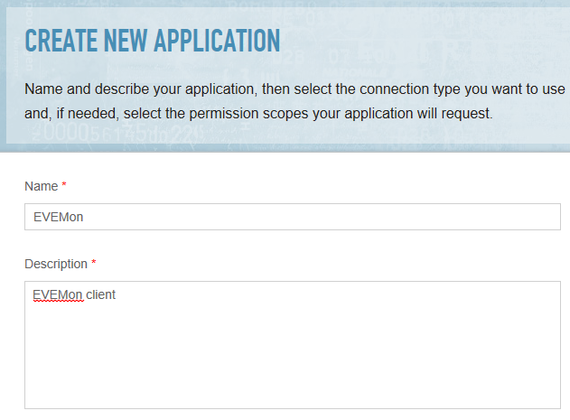
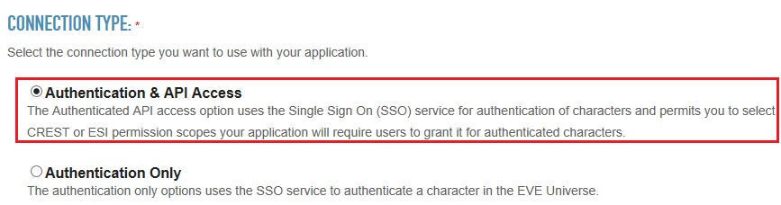
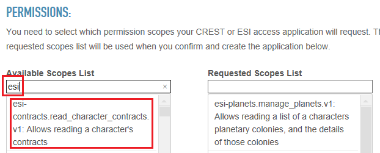
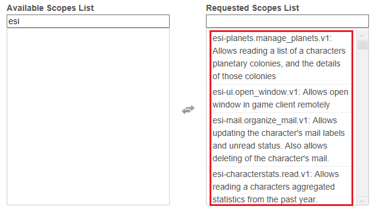
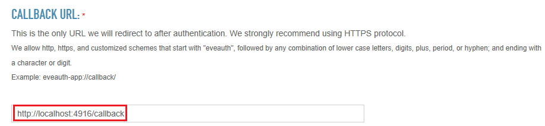
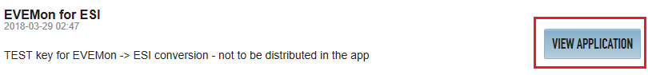
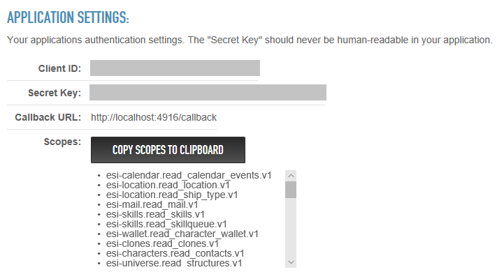
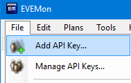

# EVEMon for ESI - Configuring Client ID

----
## Why do I have to do this?

ESI requires a client ID and client secret to function, which are theoretically unique for each application which use it. These items are used to retrieve tokens used to access your API information; a particular access token (the new version of an API key) is only usable with a given client ID and secret. Thus, these two items are intended to be kept secret for a given application.

However, hard coding the client ID and client secret in EVEMon's application code is not recommended, as it would then be available for nefarious spies to potentially see your top-secret information. Therefore, EVEMon requires that each user create their own client ID and client secret, which makes it difficult for another user (or me) to spy on you even if they obtain your tokens. The client ID and client secret **can** be reused across multiple instances of EVEMon.

## Creating your client ID
1. Go to [https://developers.eveonline.com/applications/create](https://developers.eveonline.com/applications/create)
2. Log in with a valid EVE Online username and password. *EVEMon will not see your password.* This only must be done once even if you have multiple accounts.
3. Enter an application name and description, these can be anything (EVEMon will not see these) 
4. Select *Authentication & API Access* 
5. Enter "esi" in the text box under *Available Scopes List* 
6. Click once on **all** of the items which appear in the text box to move them to the right 
7. Enter `http://localhost:4916/callback` in the *Callback URL* field 
8. Select *Create Application*
9. On the list that appears, select *View Application* on the newly created entry 
10. Scroll down to the section which shows the *Client ID* and *Client Secret* 

## Configuring EVEMon

1. Open EVEMon. If old characters are left over from versions prior to 4.0.0, back up any important skill plans and **reset settings** (`File > Reset Settings`) ![Reset Settings] (img/resetsettings.png)
2. Select `File > Add API Key`. If it is not already set up, you will be redirected to the `Network Settings` page ![Network Settings] (img/enterclientid.png)
3. Enter the *Client ID* and *Client Secret* obtained in the previous section into the fields
4. Select `OK`
5. Select `File > Add API Key` again; follow the directions to add characters just like any other tool using ESI 

*For the paranoid, EVEMon actually requires the following scopes. Leaving out a scope may result in error messages if that particular section of EVEMon is used.*

 * `esi-wallet.read_character_wallet.v1`
 * `esi-calendar.read_calendar_events.v1`
 * `esi-location.read_location.v1`
 * `esi-location.read_ship_type.v1`
 * `esi-mail.read_mail.v1`
 * `esi-skills.read_skills.v1`
 * `esi-skills.read_skillqueue.v1`
 * `esi-clones.read_clones.v1`
 * `esi-characters.read_contacts.v1`
 * `esi-universe.read_structures.v1`
 * `esi-killmails.read_killmails.v1`
 * `esi-assets.read_assets.v1`
 * `esi-planets.manage_planets.v1`
 * `esi-markets.structure_markets.v1`
 * `esi-corporations.read_structures.v1`
 * `esi-characters.read_loyalty.v1`
 * `esi-characters.read_medals.v1`
 * `esi-characters.read_standings.v1`
 * `esi-characters.read_agents_research.v1`
 * `esi-industry.read_character_jobs.v1`
 * `esi-markets.read_character_orders.v1`
 * `esi-characters.read_blueprints.v1`
 * `esi-characters.read_corporation_roles.v1`
 * `esi-contracts.read_character_contracts.v1`
 * `esi-clones.read_implants.v1`
 * `esi-characters.read_fatigue.v1`
 * `esi-killmails.read_corporation_killmails.v1`
 * `esi-wallet.read_corporation_wallets.v1`
 * `esi-characters.read_notifications.v1`
 * `esi-corporations.read_divisions.v1`
 * `esi-corporations.read_contacts.v1`
 * `esi-assets.read_corporation_assets.v1`
 * `esi-corporations.read_blueprints.v1`
 * `esi-contracts.read_corporation_contracts.v1`
 * `esi-corporations.read_standings.v1`
 * `esi-industry.read_corporation_jobs.v1`
 * `esi-markets.read_corporation_orders.v1`
 * `esi-corporations.read_medals.v1`
 * `esi-alliances.read_contacts.v1`
 * `esi-characters.read_fw_stats.v1`
 * `esi-corporations.read_fw_stats.v1`
 * `esi-corporations.read_outposts.v1`
